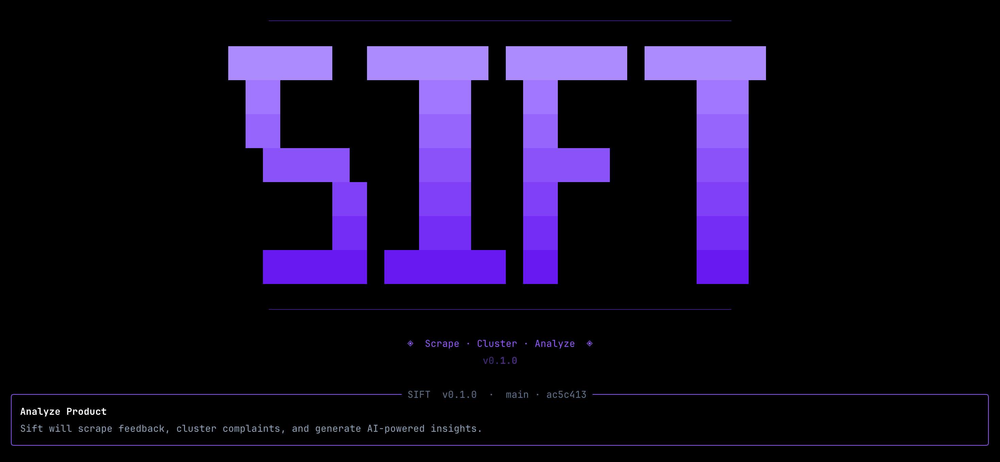

# Sift

<p align="center">
  
</p>

> Scrape user feedback from public product channels, cluster complaints with ML, and generate AI-powered product insights — all from your terminal.

## What It Does

- **Scrapes** G2, app stores, YouTube, Hacker News, GitHub issues, Product Hunt, forums, changelogs, and public exports for real user feedback about any product
- **Anonymizes** reviews at ingestion — no usernames stored, only a clickable link to the source
- **Deduplicates** feedback across sources using hash-based IDs so you never count the same review twice
- **Clusters** complaints and pain points using sentence embeddings + UMAP + HDBSCAN
- **Analyzes** each cluster with an LLM to name themes, summarize issues, and rate severity
- **Compares** multiple products to surface shared vs. unique pain points

## How It Works

```
G2 / App Stores / YouTube / HN / GitHub / Forums / Exports
          │
          └──> Feedback Items ──> Dedup Filter ──> Sentence Embeddings ──> UMAP + HDBSCAN
                       (anonymized)                                      (all-MiniLM-L12-v2)

                                          ┌── Clustered Themes ──> LLM Analysis ──> Report (MD + JSON)
              Multi-Product Comparison <──┘
```

## Install

**Prerequisites:** Python 3.11+ and an OpenAI-compatible LLM endpoint.

```bash
pip install getsift
```

## Quick Start

```bash
# 1. Install
pip install getsift

# 2. Set up (creates config.yaml and .env with your API keys)
sift init

# 3. Run — launches the interactive Rich frontend
sift
```

That's it. `sift` opens an interactive terminal UI where you pick products and sources. No CLI arguments needed.

## CLI Commands

```bash
# Interactive mode (default — just run sift)
sift

# First-run setup wizard (creates config.yaml + .env)
sift init

# Scripted/automation use:
sift analyze "Notion" "Obsidian" --source g2
sift scrape "Slack" --source g2 --source app_store

# Debug logging
sift analyze "Notion" --verbose
```

## Configuration

Edit `config.yaml` to tune the pipeline:

| Section | Key Options |
|---------|-------------|
| `sources` | `default_sources`, `disabled_sources` |
| `reddit` | `subreddits`, `max_posts`, `max_comments_per_post` |
| `g2` | `request_delay`, `max_pages`, `user_agent_rotation` |
| `app_store` / `play_store` | product-to-app/package mappings, locale, item limits |
| `youtube` | `video_ids`, `max_comments_per_video` |
| `github_issues` | product-to-repo mappings, item limits |
| `support_forums` / `changelogs` | URL templates or product URL mappings |
| `discord_exports` / `linkedin_comments` | public/export JSON paths or URLs |
| `clustering` | `embedding_model`, `umap_n_neighbors`, `hdbscan_min_cluster_size` |
| `llm` | `model`, `temperature`, `max_tokens` |
| `logging` | `level` (`INFO` or `DEBUG`), `format` |

LLM endpoint and API keys are set via `.env`:

```
LLM_API_KEY=your-key
LLM_BASE_URL=https://api.openai.com/v1
LLM_MODEL=gpt-4o-mini
YOUTUBE_API_KEY=optional-youtube-key
GITHUB_TOKEN=optional-github-token
```

Any OpenAI-compatible API works — OpenAI, Anthropic (via proxy), Ollama, OpenCode, etc.

## Data Sources

| Source | Method | Requirements |
|--------|--------|-------------|
| **G2** | Web scraping (BeautifulSoup) | None — includes User-Agent rotation and polite request delays |
| **App Store** | Apple customer reviews RSS | Product app IDs in `config.yaml` |
| **Play Store** | Public app details/reviews page | Product package names in `config.yaml` |
| **YouTube comments** | YouTube Data API | `YOUTUBE_API_KEY` and product video IDs |
| **Hacker News** | Algolia HN Search API | None |
| **GitHub issues** | GitHub Search API | Product repos; optional `GITHUB_TOKEN` |
| **Product Hunt comments** | Public product pages | Optional product slugs |
| **Support forums** | Configured public search URLs | Forum URL templates |
| **Changelogs** | Configured public changelog URLs | Product URL mappings |
| **Discord exports** | Public/exported JSON | JSON file paths or URLs |
| **LinkedIn comments** | Public/exported JSON | JSON file paths or URLs |
| **Reddit** | PRAW (official API) | Currently disabled in `sources.disabled_sources` until API approval |

> To reactivate Reddit later, remove `reddit` from `sources.disabled_sources` and add it to `sources.default_sources` if you want it in default runs.
>
> **Privacy:** Usernames and PII are stripped at ingestion. Only the review text and a clickable source link are retained.

## Output

Reports are saved to `output/` in two formats:

- **Markdown** — human-readable with severity badges, representative quotes, and comparison tables
- **JSON** — machine-readable structured data for dashboards or downstream tools

Each report includes:
- Overall product insights (LLM-generated)
- Top pain points ranked by severity
- Per-cluster summaries with representative user quotes
- For multi-product runs: shared vs. unique pain points + competitive insights

## Architecture

```
sift/
├── scrapers/          # Source adapters for public feedback channels
├── pipeline/          # Embeddings, clustering, LLM analysis, comparison, rate limiting, deduplication
├── models/            # Data classes (FeedbackItem, ClusterResult, ProductReport)
├── ui/                # Rich terminal frontend, setup wizard, interactive menus
├── config.py          # YAML + env var configuration loader
└── cli.py             # Click CLI (analyze, scrape, init commands)
tests/                 # Tests covering all modules
```

## Running Tests

```bash
python -m pytest tests/ -v
```

## Roadmap

- [ ] Reactivate Reddit source after API approval
- [ ] Web app with dashboard UI
- [ ] Continuous monitoring mode (track sentiment over time)
- [ ] Additional review sites (Trustpilot, Capterra)
- [ ] Slack/email alerting for new complaint spikes

## License

MIT
